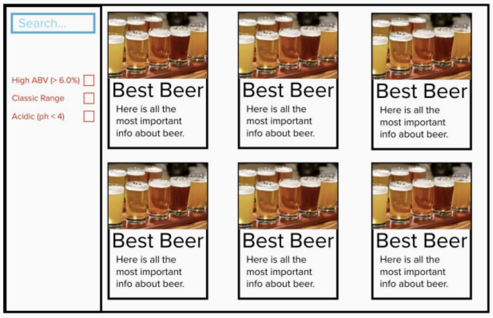
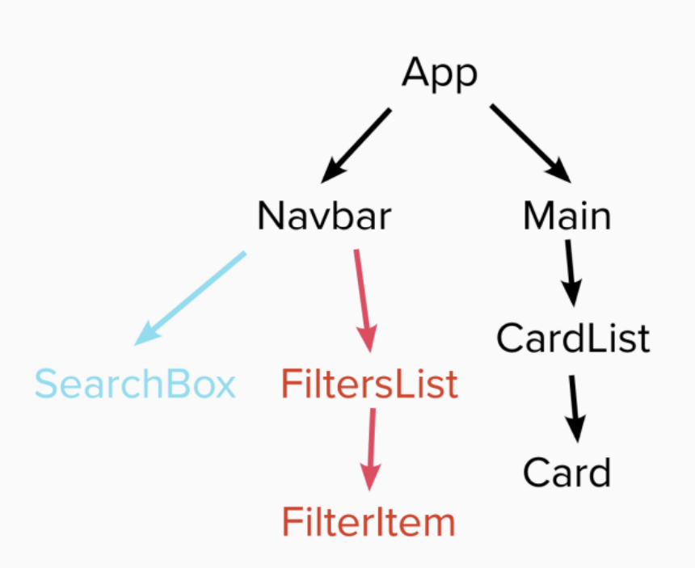
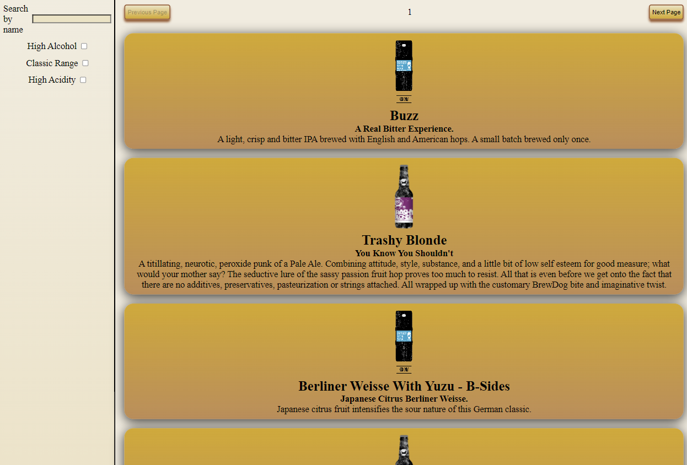
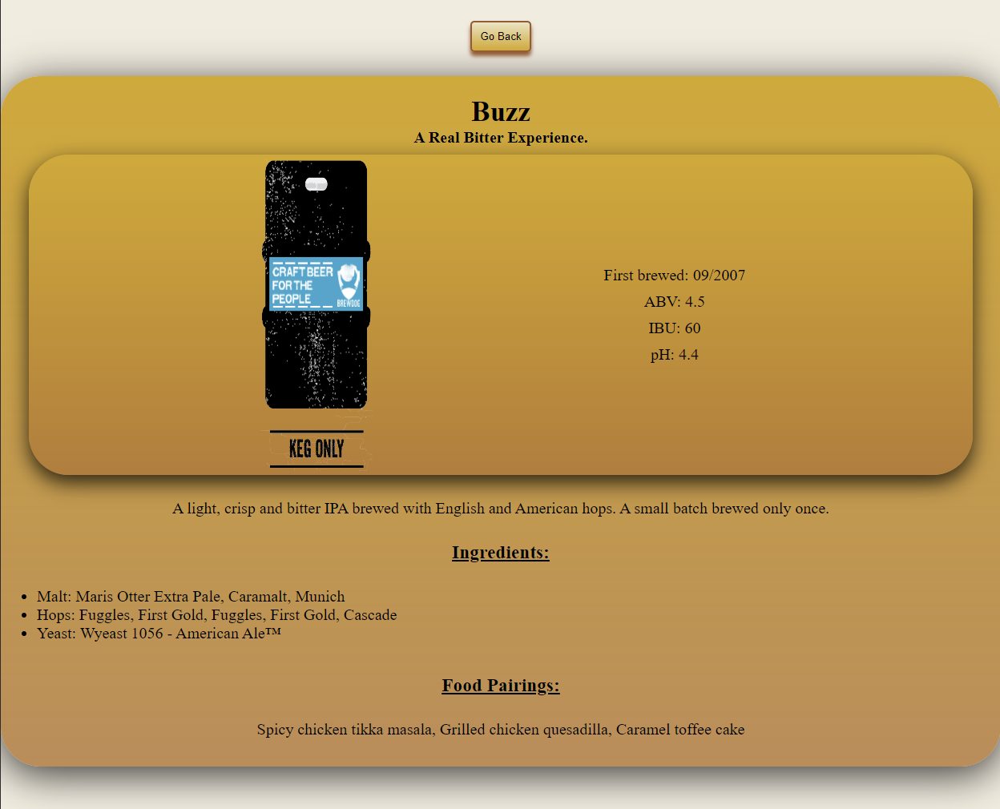
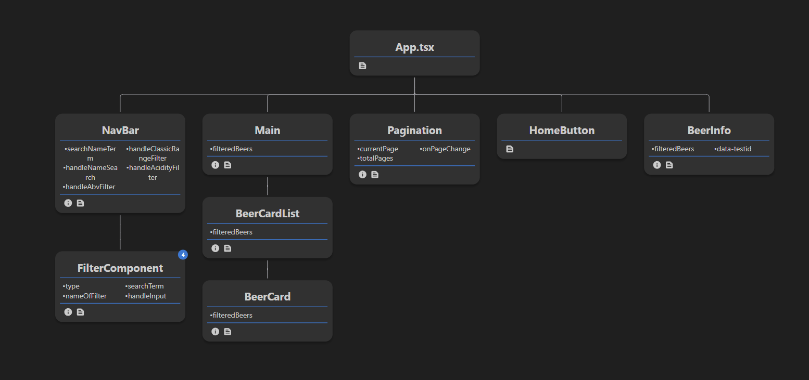

# BrewDog Punk API Website
-------

## Requirements
1. Built entirely in React
2. Repository on GitHub
3. Use the Punk API (after using the data file first) (https://punkapi.com/) -> Used local API instead
4. Test where possible (RTL)

## Plan
- Start : All the wireframe content in black is the first part of the challenge - that is, the sidenav, the main section containing the beers and beer cards for each piece of data.The component tree is below to help you get started.
1. Once you've got the design and layout sorted to render the elements, it's time to add some search functionality. Make it so you can
search the beers bytheir name, and the page content should update asyou type each letter in the box.
2. Finally attempt to make it so you can filter the content on three conditions:
 - High Alcohol (ABV value greater than 6%)
 - Classic Range (Was first brewed before 2010)
 - High Acidity(pH lower than 4)
3. Style the website howeveryou see fit! Go wild!

## Reference Image



## Reference Component Tree



## Actual webpage

Here is the actual webpage based off the the reference image.
The functionality of the search box and filter checkboxes are working, pagination has been added and all beers from the database are rendering.



Clicking on an image of a beer will also take you to their information page:


## Current Component Tree

This is the component tree that corresponds to the current webpage (shown in image above).
The props of each component is also shown.




## Using the app

The webpage can be accessed on [this page](https://byasar3.github.io/punkApi/). Due to API issues, a local API has been used and therefore the webpage is not currently functioning. Alternatively you can access the code locally by cloning it down to your own device:

First, clone the [API](https://github.com/sammdec/punkapi-server/tree/master), making sure you follow the steps and have it running.

Then clone this repository using:

```git clone https://github.com/Byasar3/punkApi.git```

cd into the repository `punkApi` and install the default Node modules:

```npm install```

to get the web app running use:

```npm run dev```

NOTE: the web app uses the local URL `http://localhost:3333` where the API is hosted automatically. The hosted URL may be different for you, if so, change any occourances of the above URL with your own.


