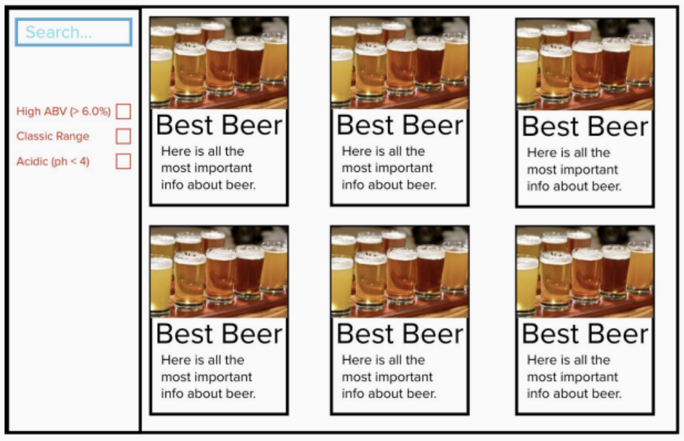
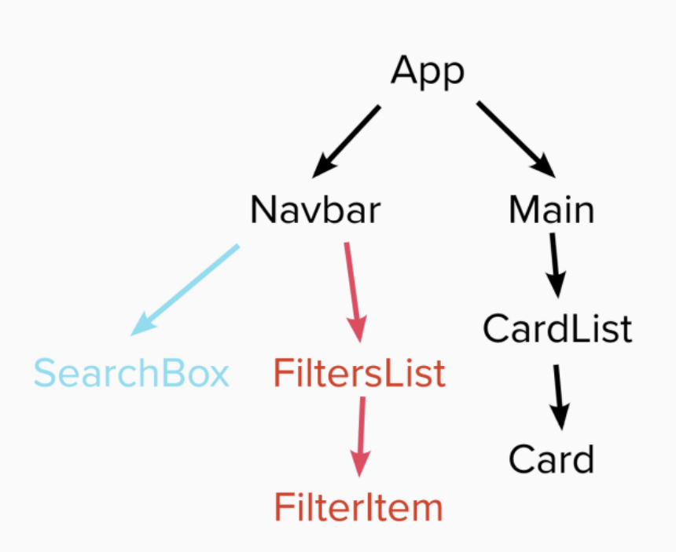

### BrewDog Punk API Website
---

## Requirements
1. Built entirely in React
2. Repository on GitHub
3. Use the Punk API (after using the data file first) (https://punkapi.com/)
4. Test where possible (RTL)

## Plan
- Start : All the wireframe content in black is the first part of the challenge - that is, the sidenav, the main section containing the beers and beer cards for each piece of data.The component tree is below to help you get started.
1. Once you've got the design and layout sorted to render the elements, it's time to add some search functionality. Make it so you can
search the beers bytheir name, and the page content should update asyou type each letter in the box.
2. Finally attempt to make it so you can filter the content on three conditions:
 - High Alcohol (ABV value greater than 6%)
 - Classic Range (Was first brewed before 2010)
 - High Acidity(pH lower than 4)
3. Style the website howeveryou see fit! Go wild!

## Reference Image

## Reference Component Tree

